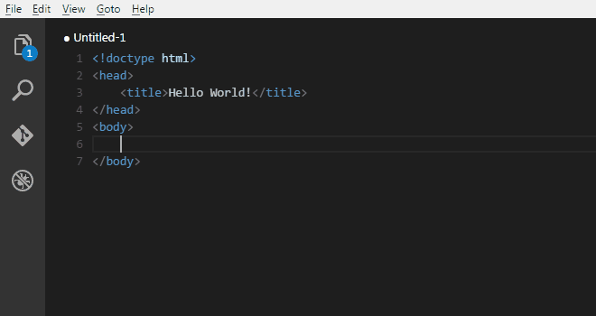

# 未曾接触的工具，需要的是了解
### [listary](https://www.listary.com/)
### [visual studio code](https://code.visualstudio.com/download)
- [使用教程(点我)](https://www.bilibili.com/video/av37265760)
- 你可以用vscode快捷编辑markdown文档并预览

### [xmind](https://www.xmind.cn/xmind8-pro/)

- 首先需要熟悉相关快捷键，比如 `insert`,`alt+ 上`, `enter` 等
- 打开思维的好工具，围绕一个主题常用关键词 `描述` 把事情描述清楚 `思路`  `步骤` 当然需要创造自己的关键词
- 思维导图是轻量级的草稿。更复杂的建议用word文档来表现
### [有道笔记](https://note.youdao.com/)
  跨平台的云笔记。支持markdown  同款有 为知笔记(支持朗读文章) 印象笔记

### 其他
#### [sharemouse](http://www.keyboard-and-mouse-sharing.com/download.php)
