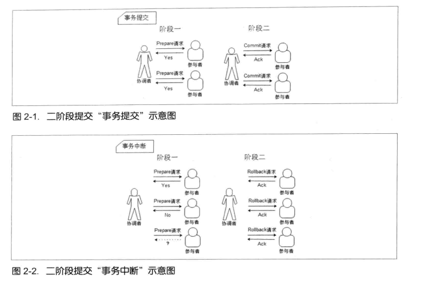
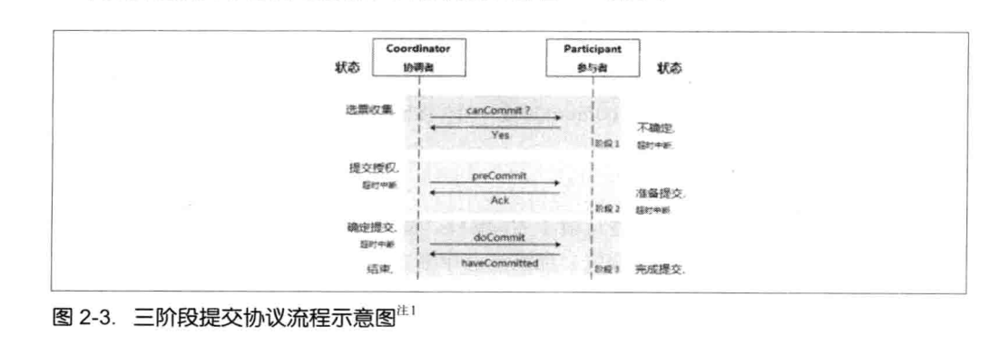
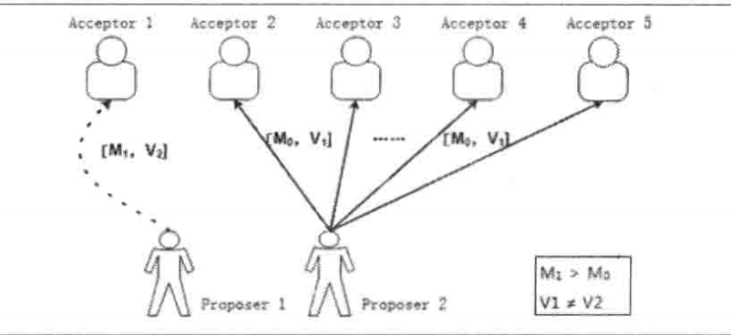

## 第2章一致性协议
在第1章内容的讲解中我们也已经提到，在对一个分布式系统进行架构设计的过程中，往往会在系统的可用性和数据一致性之间进行反复的权衡，于是就产生了一系列的一致性协议。
为了解决分布式一致性问题，在长期的探索研究过程中，涌现出了一大批经典的一致性协议和算法，其中最著名的就是二阶段提交协议、三阶段提交协议和Paxos算法了。本章将着重向读者介绍二阶段和三阶段提交协议的设计与算法实现流程，指出它们各自的优缺点，同时重点介绍Paxos算法。
### 2.12 PC与3PC
在分布式系统中，每一个机器节点虽然都能够明确地知道自己在进行事务操作过程中的结果是成功或失败，但却无法直接获取到其他分布式节点的操作结果。因此，当一个事务操作需要跨越多个分布式节点的时候，为了保持事务处理的ACID特性，就需要引入一个称为“协调者（Coordinator）”的组件来统一调度所有分布式节点的执行逻辑，这些被调度的分布式节点则被称为“参与者”（Participant）。协调者负责调度参与者的行为，并最终决定这些参与者是否要把事务真正进行提交。基于这个思想，衍生出了二阶段提交和三阶段提交两种协议，在本节中，我们将重点对这两种分布式事务中涉及的一致性协议进行讲解。
#### 2.11 2PC 
2PC，是Two-Phase Commit的缩写，即二阶段提交，是计算机网络尤其是在数据库领域内，为了使基于分布式系统架构下的所有节点在进行事务处理过程中能够保持原子性和17一致性而设计的一种算法。通常，二阶段提交协议也被认为是一种一致性协议，用来保证分布式系统数据的一致性。目前，绝大部分的关系型数据库都是采用二阶段提交协议来完成分布式事务处理的，利用该协议能够非常方便地完成所有分布式事务参与者的协调，统一决定事务的提交或回滚，从而能够有效地保证分布式数据一致性，因此二阶段提交协议被广泛地应用在许多分布式系统中。
***协议说明***
顾名思义，二阶段提交协议是将事务的提交过程分成了两个阶段来进行处理，其执行流程如下。

###### 阶段一：提交事务请求

1. 事务询问。
协调者向所有的参与者发送事务内容，询问是否可以执行事务提交操作，并开始等待各参与者的响应。
2. 执行事务。
各参与者节点执行事务操作，并将Undo和Redo信息记人事务日志中。
3. 各参与者向协调者反馈事务询问的响应。
如果参与者成功执行了事务操作，那么就反馈给协调者Yes响应，表示事务可以执行；如果参与者没有成功执行事务，那么就反馈给协调者No响应，表示事务不可以执行。
由于上面讲述的内容在形式上近似是协调者组织各参与者对一次事务操作的投票表态过程，因此二阶段提交协议的阶段一也被称为“投票阶段”，即各参与者投票表明是否要继续执行接下去的事务提交操作。
###### 阶段二：执行事务提交
在阶段二中，协调者会根据各参与者的反馈情况来决定最终是否可以进行事务提交操作，正常情况下，包含以下两种可能。
执行事务提交
假如协调者从所有的参与者获得的反馈都是Yes响应，那么就会执行事务提交。

1. 发送提交请求
协调者向所有参与者节点发出Commit请求。
2. 事务提交。
参与者接收到Commit 请求后，会正式执行事务提交操作，并在完成提交之后释放在整个事务执行期间占用的事务资源。
3.反馈事务提交结果。
参与者在完成事务提交之后，向协调者发送Ack消息。
4.完成事务。
协调者接收到所有参与者反馈的Ack消息后，完成事务。
###### 中断事务
假如任何一个参与者向协调者反馈了No响应，或者在等待超时之后，协调者尚无法接收到所有参与者的反馈响应，那么就会中断事务。
1. 发送回滚请求。
    协调者向所有参与者节点发出Rollback请求。

2. 事务回滚。
    参与者接收到Rollback请求后，会利用其在阶段一中记录的Undo信息来执行事务回滚操作，并在完成回滚之后释放在整个事务执行期间占用的资源。

3. 反馈事务回滚结果。
    参与者在完成事务回滚之后，向协调者发送Ack消息。

9. 中断事务。
    协调者接收到所有参与者反馈的Ack消息后，完成事务中断。
    以上就是二阶段提交过程中，前后两个阶段分别进行的处理逻辑。简单地讲，二阶段提交将一个事务的处理过程分为了投票和执行两个阶段，其核心是对每个事务都采用先尝试后提交的处理方式，因此也可以将二阶段提交看作一个强一致性的算法，图2-1和图2-2分别展示了二阶段提交过程中“事务提交”和“事务中断”两种场景下的交互流程。
    
**优缺点**
二阶段提交协议的优点：原理简单，实现方便。
二阶段提交协议的缺点：同步阻塞、单点问题、脑裂、太过保守。
**同步阻塞**
二阶段提交协议存在的最明显也是最大的一个问题就是同步阻塞，这会极大地限制分布式系统的性能。在二阶段提交的执行过程中，所有参与该事务操作的逻辑都处于阻塞状态，也就是说，各个参与者在等待其他参与者响应的过程中，将无法进行其他任何操作。
**单点问题**
在上面的讲解过程中，相信读者可以看出，协调者的角色在整个二阶段提交协议中起到了非常重要的作用。一旦协调者出现问题，那么整个二阶段提交流程将无法运转，更为严重的是，如果协调者是在阶段二中出现问题的话，那么其他参与者将会一直处于锁定事务资源的状态中，而无法继续完成事务操作。
    
    **数据不一致**
    在二阶段提交协议的阶段二，即执行事务提交的时候，当协调者向所有的参与者发送Commit请求之后，发生了局部网络异常或者是协调者在尚未发送完Commit请求之前自身发生了崩溃，导致最终只有部分参与者收到了Commit请求。于是，这部分收到了Commit请求的参与者就会进行事务的提交，而其他没有收到Commit 请求的参与者则无法进行事务提交，于是整个分布式系统便出现了数据不一致性现象。
    **太过保守**
    如果在协调者指示参与者进行事务提交询问的过程中，参与者出现故障而导致协调者始终无法获取到所有参与者的响应信息的话，这时协调者只能依靠其自身的超时机制来判断是否需要中断事务，这样的策略显得比较保守。换句话说，二阶段提交协议没有设计较为完善的容错机制，任意一个节点的失败都会导致整个事务的失败。
    
#### 1.2 3PC
3.在上文中，我们讲解了二阶段提交协议的设计和实现原理，并明确指出了其在实际运行过程中可能存在的诸如同步阻塞、协调者的单点问题、脑裂和太过保守的容错机制等缺陷，因此研究者在二阶段提交协议的基础上进行了改进，提出了三阶段提交协议。
**协议说明**
3PC，是Three-Phase Commit的缩写，即三阶段提交，是2PC的改进版，其将二阶段提交协议的“提交事务请求”过程一分为二，形成了由CanCommit、PreCommit和do Commit三个阶段组成的事务处理协议，其协议设计如图2-3所示。



##### 阶段一：CanCommit
1. 事务询问。
协调者向所有的参与者发送一个包含事务内容的canCommit请求，询问是否可以执行事务提交操作，并开始等待各参与者的响应。
2. 各参与者向协调者反馈事务询问的响应。
参与者在接收到来自协调者的canCommit请求后，正常情况下，如果其自身认为可以顺利执行事务，那么会反馈Yes响应，并进入预备状态，否则反馈No响应。
##### 阶段二：PreCommit在阶段二中，协调者会根据各参与者的反馈情况来决定是否可以进行事务的PreCommit操作，正常情况下，包含两种可能。
执行事务预提交
假如协调者从所有的参与者获得的反馈都是Yes响应，那么就会执行事务预提交。
1. 发送预提交请求。
    协调者向所有参与者节点发出preCommit的请求，并进入Prepared阶段。
2. 事务预提交。
    参与者接收到preCommit请求后，会执行事务操作，并将Undo和Redo信息记录到事务日志中。
3. 各参与者向协调者反馈事务执行的响应。
    如果参与者成功执行了事务操作，那么就会反馈给协调者Ack响应，同时等待最终的指令：提交（commit）或中止（abort）。
**中断事务**
假如任何一个参与者向协调者反馈了No响应，或者在等待超时之后，协调者尚无法接收到所有参与者的反馈响应，那么就会中断事务。
1.发送中断请求。
协调者向所有参与者节点发出abort请求。
2.中断事务。

无论是收到来自协调者的abort请求，或者是在等待协调者请求过程中出现超时，参与者都会中断事务。
#####　阶段三：doCommit该阶段将进行真正的事务提交，会存在以下两种可能的情况
**执行提交**
1.发送提交请求。
进入这一阶段，假设协调者处于正常工作状态，并且它接收到了来自所有参与者的Ack响应，那么它将从“预提交”状态转换到“提交”状态，并向所有的参与者发送doCommit请求。
2.事务提交。
参与者接收到doCommit请求后，会正式执行事务提交操作，并在完成提交之后释放在整个事务执行期间占用的事务资源。
3.反馈事务提交结果。
参与者在完成事务提交之后，向协调者发送Ack消息。
4.完成事务。
协调者接收到所有参与者反馈的Ack消息后，完成事务。

**中断事务**
进人入这一阶段，假设协调者处于正常工作状态，并且有任意一个参与者向协调者反馈了No响应，或者在等待超时之后，协调者尚无法接收到所有参与者的反馈响应，那么就会中断事务。
1.发送中断请求。
协调者向所有的参与者节点发送abort请求。
2.事务回滚。
参与者接收到abort请求后，会利用其在阶段二中记录的Undo信息来执行事务回滚操作，并在完成回滚之后释放在整个事务执行期间占用的资源。

3.反馈事务回滚结果。
参与者在完成事务回滚之后，向协调者发送Ack消息。
4.中断事务。
协调者接收到所有参与者反馈的Ack消息后，中断事务。需要注意的是，一旦进入阶段三，可能会存在以下两种故障。
·协调者出现问题。
·协调者和参与者之间的网络出现故障。
无论出现哪种情况，最终都会导致参与者无法及时接收到来自协调者的doCommit或是abort请求，针对这样的异常情况，参与者都会在等待超时之后，继续进行事务提交。
**优缺点**
三阶段提交协议的优点：相较于二阶段提交协议，三阶段提交协议最大的优点就是降低了参与者的阻塞范围，并且能够在出现单点故障后继续达成一致。
三阶段提交协议的缺点：三阶段提交协议在去除阻塞的同时也引入了新的问题，那就是在参与者接收到preCommit消息后，如果网络出现分区，此时协调者所在的节点和参与者无法进行正常的网络通信，在这种情况下，该参与者依然会进行事务的提交，这必然出现数据的不一致性。

### 2.2 Paxos算法

#### 2.2.1 追本溯源
#### 2.2.2 Paxos理论的诞生

#### 1.72.2.3 Paxos算法详解

##### 2.2.3Paxos 算法详解
Paxos作为一种提高分布式系统容错性的一致性算法，一直以来总是被很多人抱怨其算法理论太难理解，尤其是The Part-Time Parliament这篇以故事形式展开的论文，对于绝大部分人来说太过于晦涩。因此在本节中，我们将围绕Lamport的另一篇关于Paxos的论文Paxos Made Simple，从一个一致性算法所必须满足的条件展开，来向读者讲解Paxos作为一种一致性算法的合理性。
Paxos 算法的核心是一个一致性算法，也就是论文The Part-Time Parliament中提到的
“synod”算法，我们将从对一致性问题的描述开始来讲解该算法需要解决的实际需求。

###### 问题描述 
假设有一组可以提出提案的进程集合，那么对于一个一致性算法来说需要保证以下几点：

-  在这些被提出的提案中，只有一个会被选定。

-  如果没有提案被提出，那么就不会有被选定的提案。

-  当一个提案被选定后，进程应该可以获取被选定的提案信息。

 对于一致性来说，安全性（Safety）“°需求如下：
- 只有被提出的提案才能被选定（Chosen）。
- 只能有一个值被选定。
- 如果某个进程认为某个提案被选定了，那么这个提案必须是真的被选定的那个。
在对Paxos算法的讲解过程中，我们不去精确地定义其活性（Liveness）需求，从整体上来说，Paxos算法的目标**就是要保证最终有一个提案会被选定，当提案被选定后，进程最终也能获取到被选定的提案**。

在该一致性算法中，有三种参与角色，我们用**Proposer**、**Acceptor**和**Learner**来表示。
在具体的实现中，一个进程可能充当不止一种角色，在这里我们并不关心进程如何映射到各种角色。假设不同参与者之间可以通过收发消息来进行通信，那么：

- 每个参与者以任意的速度执行，可能会因为出错而停止，也可能会重启。同时，即使一个提案被选定后，所有的参与者也都有可能失败或重启，因此除非那些失败或重启的参与者可以记录某些信息，否则将无法确定最终的值。

- 消息在传输过程中可能会出现不可预知的延迟，也可能会重复或丢失，但是消息不会被损坏，即消息内容不会被篡改（拜占庭式的问题“0）。

###### 提案的选定
​        要选定一个唯一提案的最简单方式莫过于只允许一个Accpetor存在，这样的话，Proposer只能发送提案给该Accpetor，Acceptor会选择它接收到的第一个提案作为被选定的提案。
​		这种解决方式尽管实现起来非常简单，但是却很难让人满意，因为一旦这个Acepetor出现问题，那么整个系统就无法工作了。
​        因此，应该寻找一种更好的解决方式，例如可以使用多个Accpetor来避免Accpetor的单点问题。现在我们就来看看，在存在多个Acceptor的情况下，如何进行提案的选取：
Proposer向一个Acceptor集合发送提案，同样，集合中的每个Acceptor都可能会批准（Accept）该提案，当有足够多的Acceptor批准这个提案的时候，我们就可以认为该提案被选定了。那么，什么是足够多呢？我们假定足够多的Acceptor是整个Acceptor集合的一个子集，并且让这个集合大得可以包含Acceptor集合中的大多数成员，因为任意两个包含大多数Acceptor的子集至少有一个公共成员。另外我们再规定，每一个Acceptor最多只能批准一个提案，那么就能保证只有一个提案被选定了。

###### 推导过程

在没有失败和消息丢失的情况下，如果我们希望即使在只有一个提案被提出的情况下，仍然可以选出一个提案，这就暗示了如下的需求。

```
P1：一个Acceptor必须批准它收到的第一个提案。
```
上面这个需求就引出了另外一个问题：如果有多个提案被不同的Proposer同时提出，这可能会导致虽然每个Acceptor都批准了它收到的第一个提案，但是没有一个提案是由多数人都批准的，如图2-4所示就是这样的场景。


图2-4所示就是不同的Proposer分别提出了多个提案的场景，在这种场景下，是无法选定一个提案的。另外，即使只有两个提案被提出，如果每个提案都被差不多一半的Acceptor批准了，此时即使只有一个Acceptor出错，都有可能导致无法确定该选定哪个提案，如图2-5所示就是这样的场景。


图2-5所示就是一个典型的在任意一个Acceptor出现问题的情况下，无法选定提案的情况。在这个例子中，共有5个Acceptor，其中2个批准了提案V1，另外3个批准了提案V2，此时如果批准V2的3个Acceptor中有一个（例如图2-5中的第5个Acceptor）出错了，那么V1和V2的批准者都变成了2个，此时就无法选定最终的提案了。
因此，在Pl的基础上，**再加上一个提案被选定需要由半数以上的Acceptor批准的需求暗示着一个Acceptor必须能够批准不止一个提案**。在这里，我们使用一个全局的编号（这种全局唯一编号的生成并不是Paxos算法需要关注的地方，就算法本身而言，其假设当前已经具备这样的外部组件能够生成一个全局唯一的编号）来唯一**标识每一个被Acceptor 批准的提案**，当一个具有某Value值的提案被**半数以上**的Acceptor批准后，我们就认为该Value被选定了，此时我们也认为该提案**被选定了**。需要注意的是，此处讲到的提案已经和Value不是同一个概念了，提案变成了一个由编号和Value组成的组合体，因此我们以“[编号，Value]”来表示一个提案。
根据上面讲到的内容，我们虽然允许多个提案被选定，但同时必须要保证所有被选定的提案都具有相同的Value值一—这是一个关于提案Value的约定，结合提案的编号，该约定可以定义如下：

	P2：如果编号为Mn、Value值为Vo的提案（即[Mo，Vo]）被选定了，那么所有比编号Mo更高的，且被选定的提案，其Value值必须也是Vo

因为提案的编号是全序的，条件P2就保证了只有一个Value值被选定这一关键安全性属性。同时，一个提案要被选定，其首先必须被至少一个Acceptor批准，因此我们可以通过满足如下条件来满足P2。

	P2a：如果编号为Mo、Value值为Vo的提案（即[Mo，Vo]）被选定了，那么所有比编号Mo更高的，且被Acceptor批准的提案，其Value值必须也是Vo。

至此，我们仍然需要Pl来保证提案会被选定，但是因为通信是异步的，一个提案可能会在某个Acceptor还未收到任何提案时就被选定了，如图2-6所示。


如图2-6所示，在Acceptor l没有收到任何提案的情况下，其他4个Acceptor已经批准了来自Proposer2的提案[Mo，V1]，而此时，Proposerl产生了一个具有其他Value值的、编号更高的提案[M1，V2]，并发送给了Acceptor1。根据P1，就需要Acceptorl批准该提案，但是这与P2a矛盾，因此如果要同时满足Pl和P2a，需要对P2a进行如下强化：

```
P2b：如果一个提案[M0，V0]被选定后，那么之后任何Proposer产生的编号更高的提案，其Value值都为V0
```
因为一个提案必须在被Proposer提出后才能被Acceptor批准，因此P2b包含了P2a，进而包含了P2。于是，接下去的重点就是论证P2b成立即可：
```
假设某个提案[M0，V0]已经被选定了，证明任何编号Mn>M0的提索，其Value值都是V0。
```

###### 数学归纳法证明
我们可以通过对M，进行第二数学归纳法来进行证明，也就是说需要证明以下结论：

	叙设编号在M0到Mn-1之间的提案，其Value值都是Vo，证明编号为Mn的提案的Value值也为V0
因为编号为M0的提案已经被选定了，这就意味着肯定存在一个由半数以上的Acceptor组成的集合C，C中的每个Acceptor都批准了该提案。再结合归纳假设，“M0的提案被选定”意味着：

```
		C中的每个Acceptor都批准了一个编号在M0，到Mn-1范围内的提案，并且每个编号在M0到Mn-1范围内的被Acceptor批准的提案，Value值都为V0
```

因为任何包含半数以上Acceptor的集合S都至少包含C中的一个成员，因此我们可以认为如果保持了下面P2c的不变性，那么编号为Mn的提案的Value也为Vo。

```	
P2c：对于任意的Mn和Vn，如果提案[M0，Vn]被提出，那么肯定存在一个由半数以上的Acceptor组成的集合S，满足以下两个条件中的任意一个。
- S中不存在任何批准过编号小于Mn的提案的Acceptor。
- 选取S中所有Acceptor批准的编号小于Mn的提案，其中编号最大的那个提案Value值是Vn
```


至此，只需要通过保持P2c，我们就能够满足P2b了。
从上面的内容中，我们可以看到，从P1到P2c的过程其实是对一系列条件的逐步加强，

如果需要证明这些条件可以保证一致性，那么就需要进行反向推导：P2c=>P2b=>P2a=>P2，然后通过P2和P1来保证一致性。
我们再来看P2c，实际上P2c规定了每个Proposer如何产生一个提案：对于产生的每个提案[Mn，Vn]，需要满足如下条件。
存在一个由超过半数的Acceptor组成的集合S：
·要么S中没有Acceptor批准过编号小于Mn的任何提案。
·要么S中的所有Acceptor批准的所有编号小于Mn的提案中，编号最大的那个提案的Value值为Vn 

当每个Proposer都按照这个规则来产生提案时，就可以保证满足P2b了，接下来我们就使用第二数学归纳法来证明P2c。

首先假设提案[Mo，Vo]被选定了，设比该提案编号大的提案为[Mn，Vn]，我们需要证明的就是在P2c的前提下，对于所有的[Mn，Vn]，存在Vn=Vo。
1. 当Mn=Mo+1时，如果有这样一个编号为Mn的提案，首先我们知道[Mo，Vo]已经被选定了，那么就一定存在一个Acceptor的子集S，且S中的Acceptor已经批准了小于Mn的提案，于是，Vn只能是多数集S中编号小于Mn但为最大编号的那个提案的值。而此时因为Mn=Mo+1，因此理论上编号小于Mn但为最大编号的那个提案肯定是[Mo，Vol，同时由于S和通过[Mo，Vo]的Acceptor集合都是多数集，也就是说二者肯定有交集一—这样Proposer在确定V0取值的时候，就一定会选择Vo。
值得注意的一点是，Paxos算法的证明过程使用的是第二数学归纳法，上面实际上就是数学归纳法的第一步，验证了某个初始值成立。接下去，就需要假设编号在(Mo)+1到(Mn)-1区间内时成立，并在此基础上推导出当编号为Mn时也成立。
2. 根据假设，编号在(Mo)+1到(Mn)-1区间内的所有提案的Value值为Vo，需要证明的是编号为Mn的提案的Value值也为Vo。根据P2c，首先同样一定存在一个Acceptor的子集S，且S中的Acceptor已经批准了小于Mn的提案，那么编号为Mn的提案的Value值只能是这个多数集S中编号小于Mn但为最大编号的那个提案的值。如果这个最大编号落在Mo+l到Mn-1区间内，那么Value值肯定是Vo，如果不落在Mo+l到Mn-1区间内，那么它的编号不可能比M。再小了，肯定就是Mo，因为S也肯定会与批准[Mo，Vo]这个提案的Acceptor集合S有交集，而如果编号是Mo，那么它的Value值也是Vo，由此得证。

###### Proposer生成提案
现在我们来看看，在P2c的基础上如何进行提案的生成。对于一个Proposer来说，获取那些已经被通过的提案远比预测未来可能会被通过的提案来得简单。因此，Proposer在产生一个编号为Mn的提案时，必须要知道当前某一个将要或已经被半数以上Acceptor批准的编号**小于Mn但为最大编号**的提案。并且，Proposer会要求**所有**的**Acceptor都不要再批准任何编号小于Mn的提案**一—这就引出了如下的提案生成算法。
1. Proposer选择一个新的提案编号Mn，然后向某个Acceptor集合的成员发送请求，要求该集合中的Acceptor做出如下回应。
- 向Proposer承诺，保证不再批准任何编号小于Mn的提案。
- 如果Acceptor 已经批准过任何提案，那么其就向Proposer反馈当前该Acceptor已经批准的编号小于Mn但为最大编号的那个提案的值。
我们将该请求称为编号为Mn的提案的Prepare请求。
2. 如果Proposer收到了来自半数以上的Acceptor的响应结果，那么它就可以产生编号为Mn、Value值为Vn的提案，这里的**Vn是所有响应中编号最大的提案的Value值**。当然还存在另一种情况，就是半数以上的Acceptor都没有批准过任何提案，即响应中不包含任何的提案，那么此时Vn值就可以由Proposer任意选择。

在确定提案之后，Proposer就会将该提案再次发送给某个Acceptor集合，并期望获得它们的批准，我们称此请求为Accept请求。需要注意的一点是，此时接受Accept请求的Acceptor集合不一定是之前响应Prepare请求的Acceptor集合——这点相信读者也能够明白，任意两个半数以上的Acceptor集合，必定包含至少一个公共Acceptor。
###### Acceptor 批准提案
在上文中，我们已经讲解了Paxos算法中Proposer的处理逻辑，下面我们来看看Acceptor是如何批准提案的。
根据上面的内容，一个Acceptor可能会收到来自Proposer的两种请求，分别是Prepare请求和Accept请求，对这两类请求做出响应的条件分别如下。

- Prepare 请求：Acceptor可以在任何时候响应一个Prepare请求。
- Accept请求：在不违背Accept现有承诺的前提下，可以任意响应Accept请求。
因此，对Acceptor逻辑处理的约束条件，大体可以定义如下。
```
Pla：一个Acceptor只要尚未响应过任何编号大于Mn的Prepare请求，那么它就可以接受这个编号为Mn的提案。
```
从上面这个约束条件中，我们可以看出，Pla包含了P1。同时，值得一提的是，Paxos算法允许Acceptor忽略任何请求而不用担心破坏其算法的安全性。
###### 算法优化
在上面的内容中，我们分别从Proposer和Acceptor对提案的生成和批准两方面来讲解了Paxos算法在提案选定过程中的算法细节，同时也在提案的编号全局唯一的前提下，获得了一个满足安全性需求的提案选定算法，接下来我们再对这个初步算法做一个小优化。
尽可能地忽略Prepare请求：

```
假设一个Acceptor收到了一个编号为Mn的Prepare请求，但此时该Acceptor已经对编号大于Mn的Prepare请求做出了响应，因此它肯定不会再批准任何新的编号为Mn的提案，那么很显然，Acceptor就没有必要对这个Prepare请求做出响应，于是Acceptor可以选择忽略这样的Prepare请求。同时，Acceptor也可以忽略掉那些它已经批准过的提案的Prepare请求。
```
通过这个优化，每个Acceptor只需要记住它**已经批准的提案的最大编号**以及它已经做出Prepare请求响应的**提案的最大编号**，以便在出现故障或节点重启的情况下，也能保证P2c的不变性。而对于Proposer来说，只要它可以保证不会产生具有相同编号的提案，那么就可以丢弃任意的提案以及它所有的运行时状态信息。

###### 算法陈述
综合前面讲解的内容，我们来对Paxos算法的提案选定过程进行一个陈述。结合Proposer和Acceptor对提案的处理逻辑，就可以得到如下类似于两阶段提交的算法执行过程。
阶段一

1. Proposer选择一个提案编号Mn，然后向Acceptor的某个超过半数的子集成员发送编号为M。的Prepare请求。
2. 如果一个Acceptor收到一个编号为Mn的Prepare 请求，且编号Mn，大于该Acceptor已经响应的所有Prepare请求的编号，那么它就会将它已经批准过的最大编号的提案作为响应反馈给Proposer，同时该Acceptor会承诺不会再批准任何编号小于Mn的提案。举个例子来说，假定一个Acceptor已经响应过的所有Prepare 请求对应的提案编号分别为1、2、…、5和7，那么该Acceptor在接收到一个编号为8的Prepare请求后，就会将编号为7的提案作为响应反馈给Proposer。

阶段二

1. 如果Proposer收到来自半数以上的Acceptor对于其发出的编号为Mn的Prepare请求的响应，那么它就会发送一个针对[Mn，Vn]提案的Accept 请求给Acceptor。
注意，Vn的值就是收到的响应中编号最大的提案的值，如果响应中不包含任何提案，那么它就是任意值。
2. 如果Acceptor收到这个针对[Mn，V]提案的Accept请求，只要该Acceptor尚未对编号大于Mn的Prepare请求做出响应，它就可以通过这个提案。

当然，在实际运行过程中，每一个Proposer都有可能会产生多个提案，但只要每个Proposer都遵循如上所述的算法运行，就一定能够保证算法执行的正确性。值得一提的是，每个Proposer都可以在任意时刻丢弃一个提案，哪怕针对该提案的请求和响应在提案被丢弃后会到达，但根据Paxos算法的一系列规约，依然可以保证其在提案选定上的正确性。事实上，如果某个Proposer已经在试图生成编号更大的提案，那么丢弃一些旧的提案未尝不是一个好的选择。因此，如果一个Acceptor因为已经收到过更大编号的Prepare 请求而忽略某个编号更小的Prepare或者Accept请求，那么它也应当通知其对应的Proposer，以便该Proposer也能够将该提案进行丢弃一—这和上面“算法优化”部分提到的天丢弃是一致的；
######　提案的获取
在上文中，我们已经介绍了如何来选定一个提案，下面我们再来看看如何让Learner获取提案，大体可以有以下几种方案。
**方案一**
Learner获取一个已经被选定的提案的前提是，该提案已经被半数以上的Acceptor批准。因此，最简单的做法就是一旦Acceptor批准了一个提案，就将该提案发送给所有的Learner。
很显然，这种做法虽然可以让Learner尽快地获取被选定的提案，但是却需要让每个Acceptor与所有的Learner逐个进行一次通信，通信的次数至少为二者个数的乘积。
**方案二**
另一种可行的方案是，我们可以让所有的Acceptor将它们对提案的批准情况，统一发送给一个特定的Learner（下文中我们将这样的Learner称为“主Learner”），在不考虑拜占庭将军问题的前提下，我们假定Learner之间可以通过消息通信来互相感知提案的选定情况。基于这样的前提，当主Learner被通知一个提案已经被选定时，它会负责通知其他的Learner。
在这种方案中，Acceptor首先会将得到批准的提案发送给主Learner，再由其同步给其他Learner，因此较方案一而言，方案二虽然需要多一个步骤才能将提案通知到所有的Learner，但其通信次数却大大减少了，通常只是Acceptor和Learner的个数总和。但同时，该方案引入了一个新的不稳定因素：主Learner随时可能出现故障。
**方案三**
在讲解方案二的时候，我们提到，方案二最大的问题在于主Learner存在单点问题，即主Learner随时可能出现故障。因此，对方案二进行改进，可以将主Learner的范围扩大，即Acceptor可以将批准的提案发送给一个特定的Learner集合，该集合中的每个Learner都可以在一个提案被选定后通知所有其他的Learner。这个Learner集合中的Learner个数越多，可靠性就越好，但同时网络通信的复杂度也就越高。

###### 通过选取主Proposer保证算法的活性
根据前面的内容讲解，我们已经基本上了解了Paxos算法的核心逻辑，下面我们再来看看Paxos算法在实际运作过程中的一些细节。假设存在这样一种极端情况，有两个Proposer依次提出了一系列编号递增的议案，但是最终都无法被选定，具体流程如下：
```
Proposer P1提出了一个编号为M1的提案，并完成了上述阶段一的流程。但与此同时，另外一个ProposerP2提出了一个编号为M2（M2>M1）的提案，同样也完成了阶段一的流程，于是Acceptor已经承诺不再批准编号小于M2的提案了。因此，当P1进入阶段二的时候，其发出的Accept请求将被Acceptor忽略，于是P1再次进入阶段一并提出了一个编号为M3（M3>M2）的提案，而这又导致P2在第二阶段的Accept请求被忽略，以此类推，提案的选定过程将陷入死循环，如图2-7所示。
```


为了保证Paxos算法流程的可持续性，以避免陷入上述提到的“死循环”，就必须选择一个主Proposer，并规定只有主Proposer才能提出议案。这样一来，只要主Proposer和过半的Acceptor能够正常进行网络通信，那么但凡主Proposer提出一个编号更高的提案，该提案终将会被批准。当然，如果Proposer发现当前算法流程中已经有一个编号更大的提案被提出或正在接受批准，那么它会丢弃当前这个编号较小的提案，并最终能够选出一个编号足够大的提案。因此，如果系统中有足够多的组件（包括Proposer、Acceptor和其他网络通信组件）能够正常工作，那么通过选择一个主Proposer，整套Paxos算法流程就能够保持活性。

###### 小结
在本章中，我们主要从协议设计和原理实现角度详细讲解了二阶段提交协议、三阶段提交协议和Paxos这三种典型的一致性算法。可以说，这三种一致性协议都是非常优秀的分布式一致性协议，都从不同方面不同程度地解决了分布式数据一致性问题，使用范围都非常广泛。其中二阶段提交协议解决了分布式事务的原子性问题，保证了分布式事务的多个参与者要么都执行成功，要么都执行失败。但是，在二阶段解决部分分布式事务问题的同时，依然存在一些难以解决的诸如同步阻塞、无限期等待和“脑裂”等问题。
三阶段提交协议则是在二阶段提交协议的基础上，添加了PreCommit过程，从而避免了二阶段提交协议中的无限期等待问题。而Paxos算法引入了“过半”的理念，通俗地讲就是少数服从多数的原则。同时，Paxos算法支持分布式节点角色之间的轮换，这极大地避免了分布式单点的出现，因此Paxos算法既解决了无限期等待问题，也解决了“脑裂”问题.是目前来说最优秀的分布式一致性协议之一